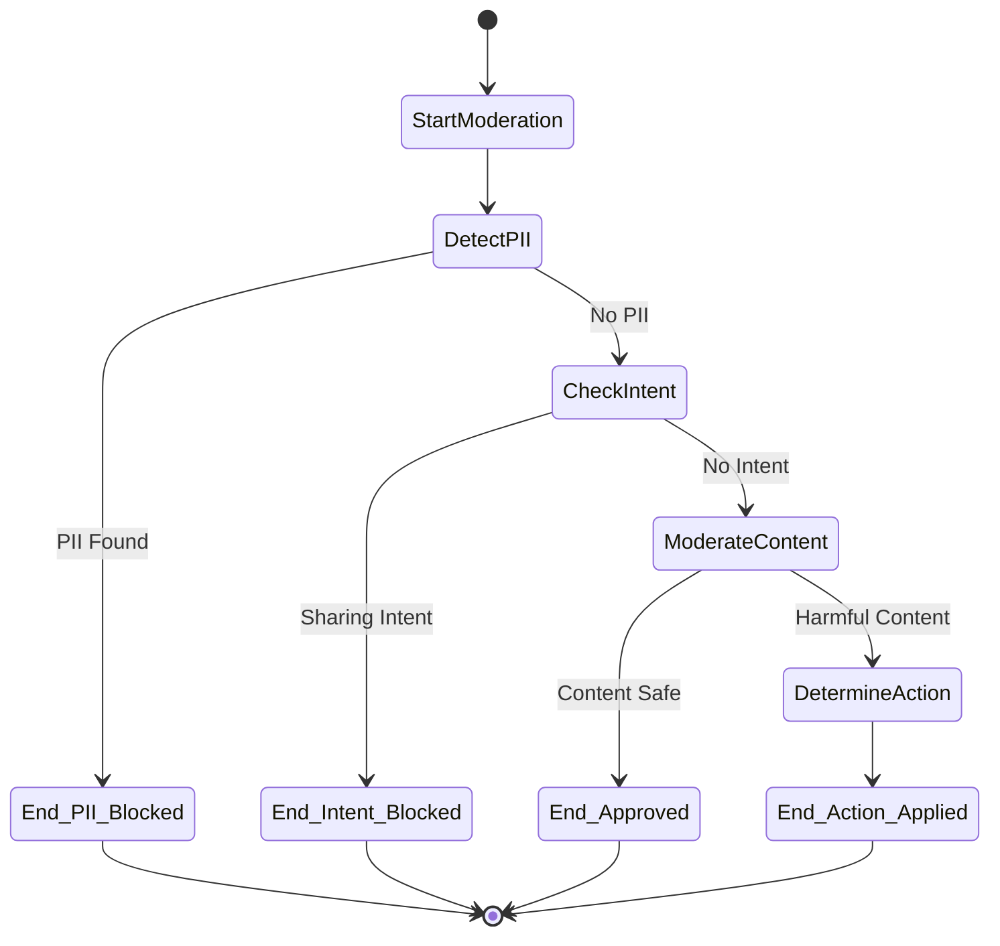
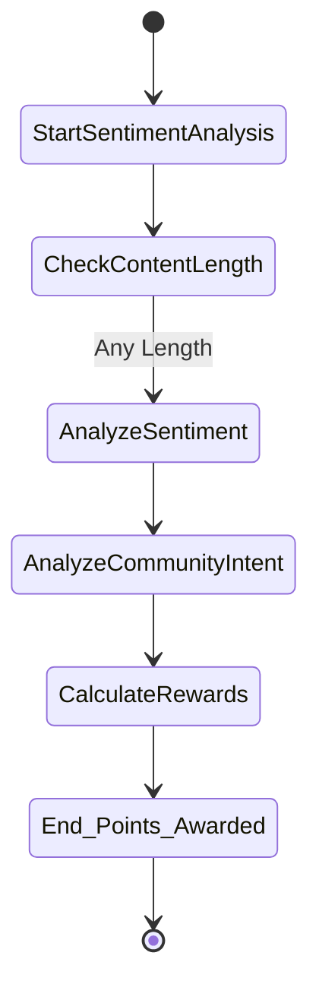

# Bloom Dashboard - Backend
> Real-time message moderation and sentiment analysis backend using finite state machines and orchestrator-worker pattern

A message processing backend built with FastAPI and Pydantic AI, implementing finite state machine workflows for content moderation and sentiment analysis in gaming communities. Features graph-based agent orchestration, PII detection, and behavioral scoring.

## Quick Start

### Installation

```bash
git clone https://github.com/katjpg/bloom-ai-dashboard.git
cd bloom-ai-dashboard/backend

python3.11 -m venv venv
source venv/bin/activate  # On Windows: venv\Scripts\activate

pip install -r requirements.txt
```

### Environment Setup

Create a `.env` file in the backend directory:

```env
# Required
GEMINI_API_KEY=your_google_gemini_api_key_here
HF_TOKEN=your_huggingface_token_here
SUPABASE_URL=your_supabase_project_url
SUPABASE_KEY=your_supabase_anon_key

# Optional
ROBLOX_API_KEY=your_api_key_for_protected_endpoints
```

**Required Services:**
- **Gemini API Key**: Get from [Google AI Studio](https://aistudio.google.com/app/apikey)
- **HuggingFace Token**: Get from [HuggingFace Settings](https://huggingface.co/settings/tokens)
- **Supabase**: Create project at [Supabase](https://supabase.com) for database persistence

### Running the Application

```bash
fastapi dev app.py
```

**Expected Output:**
```
FastAPI   Starting development server
module   app.py
server   Server started at http://127.0.0.1:8000
server   Documentation at http://127.0.0.1:8000/docs
```

**Access Points:**
- **API Documentation**: http://127.0.0.1:8000/docs
- **Health Check**: http://127.0.0.1:8000/api/health
- **System Stats**: http://127.0.0.1:8000/api/stats
- **Live Dashboard**: http://127.0.0.1:8000/api/live

## Finite State Machine Architecture

### Moderation State Machine



**State Machine Features:**
- **PII Detection**: Personal information identification using HuggingFace transformers
- **Intent Analysis**: Pydantic AI agent for sharing intent classification
- **Content Classification**: Multi-label content moderation (hate speech, spam, threats)
- **Action Determination**: Gemini-based moderation action selection

### Sentiment Analysis State Machine



**State Machine Features:**
- **Sentiment Scoring**: RoBERTa-based emotion analysis with neutral dampening
- **Community Intent**: Gaming-specific behavioral pattern recognition
- **Reward Calculation**: Dynamic point allocation based on contribution metrics
- **Length Filtering**: Minimum character threshold for analysis

## Orchestrator-Worker Pattern

The system implements a hierarchical orchestrator-worker architecture:

**Orchestrator Layer** (`/services/chat.py`):
- Coordinates moderation and sentiment workflows
- Manages state transitions between agent systems
- Handles error recovery and fallback mechanisms

**Worker Agents** (`/agents/`):
- **Moderation Workers**: PII detection, intent analysis, content classification
- **Sentiment Workers**: Emotion analysis, community intent, reward calculation
- **Specialized Models**: HuggingFace transformers, Gemini language models

**Graph Execution**:
- Pydantic Graph manages node execution order
- State persistence across workflow transitions
- Conditional routing based on previous node outputs

## API Endpoints

### Core Endpoints

| Method | Endpoint | Description |
|--------|----------|-------------|
| `POST` | `/api/moderate` | Execute moderation pipeline only |
| `POST` | `/api/analyze` | Create message and run sentiment + moderation (requires API key) |
| `POST` | `/api/sentiment` | Execute sentiment analysis only |
| `GET` | `/api/users/{user_id}/score` | Retrieve user sentiment score |
| `GET` | `/api/leaderboard` | Query top scoring users |
| `GET` | `/api/stats` | System performance metrics |
| `GET` | `/api/health` | Service health status |

### Message Management

| Method | Endpoint | Description |
|--------|----------|-------------|
| `POST` | `/api/flag` | Flag a message for review |
| `GET` | `/api/flagged` | Retrieve flagged messages queue |
| `GET` | `/api/messages` | Fetch messages with optional filters |
| `GET` | `/api/live` | Get 20 most recent messages with moderation data |

### Player Data

| Method | Endpoint | Description |
|--------|----------|-------------|
| `GET` | `/api/players` | Fetch all players |
| `GET` | `/api/top-players` | Get top players by sentiment score |
| `GET` | `/api/roblox-avatar` | Proxy endpoint for Roblox avatar thumbnails |

### Example Requests

#### Moderation Only
```bash
curl -X POST http://localhost:8000/api/moderate \
  -H "Content-Type: application/json" \
  -d '{
    "message": "Great job everyone! Keep up the excellent work!",
    "message_id": "msg_001",
    "player_id": 123,
    "player_name": "CoolPlayer123"
  }'
```

#### Full Analysis (with API Key)
```bash
curl -X POST http://localhost:8000/api/analyze \
  -H "Content-Type: application/json" \
  -H "X-API-Key: your_api_key_here" \
  -d '{
    "message": "Great job everyone! Keep up the excellent work!",
    "message_id": "msg_001",
    "player_id": 123,
    "player_name": "CoolPlayer123"
  }'
```

### Response Formats

#### Moderation Response
```json
{
  "moderation_state": {
    "message": {
      "message": "Great job everyone! Keep up the excellent work!",
      "message_id": "msg_001",
      "player_id": 123,
      "player_name": "CoolPlayer123"
    },
    "pii_result": null,
    "content_result": {"main_category": "OK"},
    "recommended_action": null
  }
}
```

#### Full Analysis Response
```json
{
  "message_id": "msg_001",
  "player_id": 123,
  "player_name": "CoolPlayer123",
  "sentiment_score": 87,
  "community_intent": "ENCOURAGEMENT",
  "points_awarded": 4,
  "moderation_action": null,
  "timestamp": "2025-01-23T20:00:00Z"
}
```

## Project Structure

```
backend/
├── agents/
│   ├── moderation/
│   │   ├── state.py
│   │   ├── nodes.py
│   │   ├── graph.py
│   │   └── __init__.py
│   └── sentiment/
│       ├── state.py
│       ├── nodes.py
│       ├── graph.py
│       └── __init__.py
├── services/
│   ├── moderation.py
│   ├── sentiment.py
│   └── chat.py
├── routes/
│   ├── chat.py
│   └── data.py
├── models/
│   └── chat.py
├── utils/
│   └── dependencies.py
├── app.py
├── requirements.txt
└── .env
```

### Architecture Principles

- **Finite State Machines**: Deterministic state transitions using Pydantic Graph
- **Orchestrator-Worker Pattern**: Hierarchical task distribution and coordination
- **Type Safety**: Complete Pydantic validation across all state transitions
- **Async Processing**: Non-blocking I/O for external API integrations
- **Modular Design**: Isolated agent workflows with clean dependency injection

## Configuration

### Model Configuration

Edit configuration constants in `/agents/*/nodes.py`:

```python
# Language Models
GEMINI_MODEL = "google-gla:gemini-2.0-flash"

# Transformer Endpoints
PII_DETECTION_API_URL = "https://router.huggingface.co/..."
SENTIMENT_API_URL = "https://router.huggingface.co/..."

# State Machine Thresholds
POSITIVE_SENTIMENT_THRESHOLD = 30
POSITIVE_ACTION_POINTS = 2
```

### Environment Variables

```env
# Required
GEMINI_API_KEY=your_key_here
HF_TOKEN=your_token_here
SUPABASE_URL=your_supabase_url
SUPABASE_KEY=your_supabase_key

# Optional
ROBLOX_API_KEY=your_api_key  # For protected endpoints
LOG_LEVEL=INFO
API_TIMEOUT=30
```

## Database Integration

### Supabase Tables

- **players**: Player information (id, name, last_seen)
- **messages**: Message data with sentiment scores and moderation actions

### RPC Functions

- `get_live_messages(p_limit)`: Returns recent messages with moderation data
- `get_top_players_by_sentiment(p_limit)`: Returns leaderboard data

### Storage Pattern

- **Database**: Persistent storage for messages, players, and historical data
- **In-Memory**: Real-time caching for user scores and recent moderation results
- **Hybrid Access**: API endpoints check both sources for comprehensive data

## Monitoring

- **State Metrics**: Real-time workflow execution statistics
- **Agent Performance**: Individual node execution timing
- **User Scoring**: Community engagement analytics with database persistence
- **System Health**: Service availability monitoring
- **Live Dashboard**: Real-time message feed with moderation status


